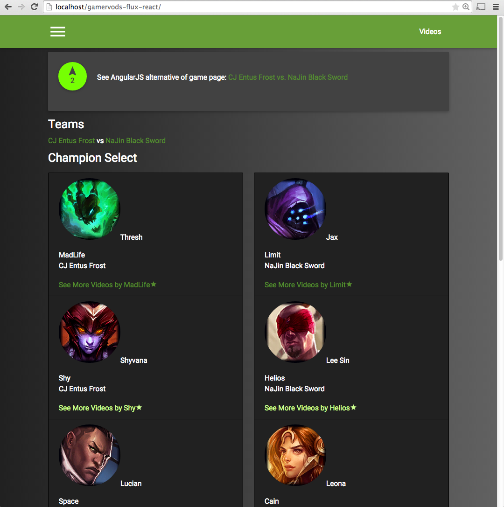
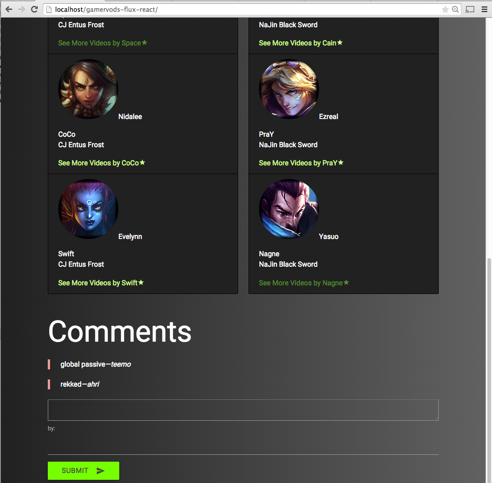

flux-react-app-and-tutorials
===============

Direct application comparison between Flux and React (0.13.3) and AngularJS (1.3).
This /gamervods-flux-react folder is an exploratory Flux/React architecture alternative to the AngularJS implementation.
The Flux/React demo app is at http://www.mailanreiser.com/flux and the AngularJS app is at http://www.gamervods.com/#/games/1080

The full AngularJS application is hosted at http://www.gamervods.com
Features include:
* ui-route for nested routing paths
* authentication and account management with Django rest API (using CSRF token)
* infinity scroll
* simple comments and upvotes
* video directives
* instantaneous search through angular filtering

This gamervods-flux-react repository is a work in progress trying to recreate gamervods.com's AngularJS application

## Timeline

5/16/2015 - 5/17/2015, /gamervods-flux-react is only a single game page in flux and react
comparable view/component in AngularJs is located at: http://www.gamervods.com/#/games/1080
* using mock data of a game, not api itself
* upvote function is also with mock data and not connected to the api unlike on gamervods
* comments are using mock comment.json data
* adding a new comments is optimistically added to the list to make the app feel faster (and no api hookup call)


Also included in this repository are introductory and tutorial files:
/tutorial-files
* flux-shoppingcart with Flux and React (from scotch.io Ken Wheeler) : (/tutorial-files/src/flux-shoppingcart)
* official react tutorial with react 0.13.3 : (/tutorial-files/src/officialtutorial)
* scotch.io introduction to react tutorials : (/tutorial-files/src/scotchio)

## History
I've heard a lot about Flux and React, so I spent the weekend trying to recreate http://www.gamervods.com/#/games/1080 to learn the Flux and React architecture.
gamervods.com is written with AngularJS but I wanted a direct comparison between AngularJS and Flux&React.
The Flux and AngularJS tutorials on the web great, but I believe nothing cements your knowledge better than building an application that you care about.


## Usage and Tree Folder Structure

The angularJS application can be run from any web host, simply clone the repo and point to your web host:

```bash
git clone https://github.com/iammai/angular-skeleton-app-directive-example.git
```

You'll see the flux & react application and how its components are organized

PNG of what you should see



```
Gamervods Flux React App
├── app
│   ├── GameData.js
│   ├── actions
│   │   └── FluxSummaryActions.js
│   ├── app.js
│   ├── bundle.js
│   ├── bundle.min.js
│   ├── components
│   │   ├── FluxComment.react.js
│   │   ├── FluxGame.react.js
│   │   ├── FluxSummary.react.js
│   │   └── FluxSummaryApp.react.js
│   ├── constants
│   │   └── FluxSummaryConstants.js
│   ├── dispatcher
│   │   └── AppDispatcher.js
│   ├── stores
│   │   ├── GameStore.js
│   │   └── SummaryStore.js
│   └── utils
│       └── SummaryAPI.js
├── comments.json
├── index.html
└── package.json
```

NPM Commands

To build gamervods-flux-react/app/bundle.min.js
```bash
npm run build
```
To develop and watch - build.js will build automatically at gamervods-flux-react/app/bundle.js
```bash
npm start
```

## Credits
Influenced and inspired by

* Shopping Cart: Flux and React - https://scotch.io/tutorials/creating-a-simple-shopping-cart-with-react-js-and-flux
* Official React Tutorial - https://facebook.github.io/react/docs/tutorial.html

